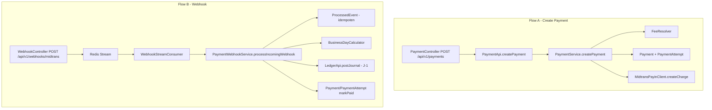

# Panduan Baca Kode — Payment M1 + M2

> Dokumen pribadi untuk memahami alur kode. Bukan dokumen normatif.
> Jalur baca disusun dari **luar ke dalam**: HTTP → kontrak → service → entity/DB → provider → ledger.

Dua alur utama:
- **Jalur A** — buat pembayaran (PAYIN): request HTTP sampai charge ke Midtrans.
- **Jalur B** — webhook: verifikasi → idempotensi → status → jurnal **J-1** ke ledger.

Diagram ringkas:



---

## Persiapan (konteks dulu, ~5 menit)

Baca dokumentasi supaya saat baca kode tidak bingung istilah:

1. `readme/payment/overview.md` — prinsip + tabel event → jurnal.
2. `readme/payment/states.md` — state machine `payments` / `payment_attempts`.
3. `readme/ledger/examples.md` — angka J-1 sebagai patokan.
4. `readme/payment/example.md` — contoh end-to-end.

---

## Jalur A — Buat Payment (PAYIN)

Baca berurutan dari luar ke dalam:

| # | File | Untuk apa |
|---|---|---|
| 1 | `payment/internal/delivery/http/PaymentController.java` | Pintu HTTP `POST /api/v1/payments`; request → `CreatePaymentCommand`. |
| 2 | `payment/internal/delivery/http/req/CreatePaymentRequest.java` | Validasi input (bean validation). |
| 3 | `payment/api/PaymentApi.java` | Kontrak publik facade. |
| 4 | `payment/api/dtos/CreatePaymentCommand.java` | Input dari consumer. |
| 5 | `payment/api/dtos/CreatePaymentResult.java` | Output gabungan payment + attempt. |
| 6 | `payment/api/dtos/PaymentResponse.java` | DTO baca payment. |
| 7 | `payment/api/dtos/PaymentAttemptResponse.java` | DTO baca attempt. |
| 8 | `payment/internal/service/PaymentService.java` (`createPayment`) | **Inti A** (orkestrator non-transaksional): idempotency → pilih route → hitung fee → buat Payment+Attempt → charge. Penulisan DB didelegasikan ke `PaymentWriter`. |
| 8b | `payment/internal/service/PaymentWriter.java` | Batas transaksi: TX#1 simpan Payment+Attempt, TX#2 simpan hasil charge. Charge provider di luar transaksi. |
| 9 | `payment/internal/service/FeeResolver.java` | Snapshot fee (pgFee, platformFee, netCreator, totalCharged); pembulatan `Math.round`. |
| 10 | `payment/internal/repository/ChannelRepository.java` | Cari channel by code. |
| 11 | `payment/internal/repository/ChannelRouteRepository.java` | `findActiveRoute` (aktif + priority; pemenang saja, tanpa amount). |
| 12 | `payment/internal/repository/ProviderRepository.java` | `findByCode`. |
| 13 | `payment/internal/repository/PaymentRepository.java` | `findByIdempotencyKey`. |
| 14 | `payment/internal/repository/PaymentAttemptRepository.java` | Cari attempt terakhir per payment. |
| 15 | `payment/internal/entity/Payment.java` | `create`, `applyFeeSnapshot`, `applyMetadata`, `markPending`. |
| 16 | `payment/internal/entity/PaymentAttempt.java` | `initiate` (id = order_id), `applyChargeResult`, `markPending`. |
| 17 | `payment/internal/provider/PayinProvider.java` | SPI payin (vendor-blind). |
| 18 | `payment/internal/provider/dtos/ChargeRequest.java` | Perintah charge netral. |
| 19 | `payment/internal/provider/dtos/ChargeResult.java` | Hasil charge + raw payload (audit). |
| 20 | `payment/internal/provider/midtrans/MidtransPayinClient.java` | Implementasi vendor: `createCharge`, `getStatus`, verifikasi signature. |
| 21 | `payment/internal/provider/midtrans/MidtransChargeRequest.java` / `MidtransChargeResponse.java` | Payload vendor. |
| 22 | `payment/internal/provider/midtrans/MidtransProperties.java` / `MidtransConfig.java` | Config `pg.midtrans.*` + bean `RestClient`. |
| 23 | `test/.../PaymentServiceTest.java` | Perilaku yang diharapkan: create sukses + idempotent replay. |
| 24 | `test/.../FeeResolverTest.java` | Angka fee yang benar. |

---

## Jalur B — Webhook → Status + J-1

| # | File | Untuk apa |
|---|---|---|
| 1 | `payment/internal/delivery/http/WebhookController.java` | `POST /api/v1/webhooks/{provider}`; verifikasi signature cepat, lempar ke Redis (tanpa DB). |
| 2 | `payment/internal/config/WebhookRedisStreamConfig.java` | Consumer group + `StreamMessageListenerContainer`. |
| 3 | `payment/internal/config/WebhookConsumerName.java` | Nama consumer unik per instance. |
| 4 | `payment/internal/service/WebhookStreamConsumer.java` | Ambil pesan → proses → ACK bila sukses. |
| 5 | `payment/internal/service/PaymentWebhookService.java` (`processIncomingWebhook`, sekitar baris 41) | **Inti B**: parse+verifikasi → inbox `ProcessedEvent` → load attempt+payment → guard terminal → PAID: settlement + J-1 → ubah status. |
| 6 | `payment/internal/service/BusinessDayCalculator.java` (`plusBusinessDays`) | Hitung T+n hari kerja. |
| 7 | `payment/internal/repository/HolidayRepository.java` | Hari libur nasional (`payment.holidays`). |
| 8 | `payment/internal/entity/ProcessedEvent.java` | Inbox idempotensi webhook (unique provider+event). |
| 9 | `payment/internal/entity/Payment.java` | `scheduleSettlement`, `markPaid`, `markExpired`, `markFailed`, `isTerminal`, `platformFeeExcludingVat`. |
| 10 | `payment/internal/entity/PaymentAttempt.java` | `markPaid`, `markExpired`, `markFailed`. |
| 11 | `ledger/api/LedgerApi.java` (`postJournal`) | Satu-satunya jalur tulis jurnal. |
| 12 | `ledger/api/dtos/JournalLine.java` | Satu baris debit/kredit. |
| 13 | `ledger/api/enums/AccountCode.java` | Sumber kebenaran akun. |
| 14 | `ledger/api/enums/EntryDirection.java` | DEBIT / CREDIT. |
| 15 | `ledger/api/enums/JournalReferenceType.java` | PAYMENT / SETTLEMENT / ... |
| 16 | `ledger/internal/service/LedgerService.java` | Implementasi posting: idempotency + locking akun. |
| 17 | `ledger/internal/validator/JournalValidator.java` | Validasi Σdebit = Σkredit. |
| 18 | `ledger/internal/service/AccountService.java` | Lazy get-or-create akun. |
| 19 | `payment/internal/job/WebhookPelRecoveryJob.java` | Quartz reclaim pesan PEL yang macet. |
| 20 | `test/.../PaymentWebhookServiceTest.java` | Perilaku: J-1 balance, duplicate event, terminal guard. |
| 21 | `test/.../BusinessDayCalculatorTest.java` | Aturan hari kerja. |

---

## Penunjang (buka saat butuh)

- **Error & i18n**: `payment/internal/exception/PaymentError.java` → `platform/exception/ServiceException.java` → `platform/web/GlobalExceptionHandler.java` → `resources/i18n/payment/messages*.properties`.
- **Batas modul**: `payment/package-info.java`, `ledger/api/package-info.java`, `ledger/api/dtos/package-info.java`, `ledger/api/enums/package-info.java`, lalu `test/.../ModularityTests.java`.
- **Enum status**: `payment/api/enums/PaymentStatus.java`, `PaymentAttemptStatus.java`, `ChannelType.java`, `ProcessedEventType.java`.

---

## Titik yang wajib diperhatikan saat baca

1. `PaymentService` — attempt dibuat **sebelum** charge supaya `order_id = payment_attempts.id` (UUID v7). Charge provider dipanggil **di luar transaksi** (lihat `PaymentWriter`); §3 transactions: transaksi singkat, tanpa remote I/O.
2. `FeeResolver` — `platformFeeAmount` **termasuk** PPN; untuk `PLATFORM_FEE_REVENUE` pakai `Payment.platformFeeExcludingVat()`.
3. `PaymentWebhookService` — pembulatan hari kerja dan guard `isTerminal()` (event telat diabaikan, bukan menurunkan status).
4. `LedgerService` — idempotency key dibuat pemanggil (`PAYMENT:{id}:PAID`), ledger hanya append.

---

## Cara verifikasi cepat

```bash
./mvnw test
./mvnw -o test -Dtest='PaymentServiceTest,PaymentWebhookServiceTest,FeeResolverTest,BusinessDayCalculatorTest'
./mvnw -o test -Dtest='ModularityTests'
```

Butuh Postgres (`5432`) & Redis (`6379`) hidup untuk `ApplicationTests`.

---

## Sisa milestone (belum ada)

- **M3** — Settlement otomatis Quartz + J-2/J-3.
- **M4** — Withdrawal & payout (Flip).
- **M5** — Refund/chargeback/adjustment/reconciliation, admin fee config.
