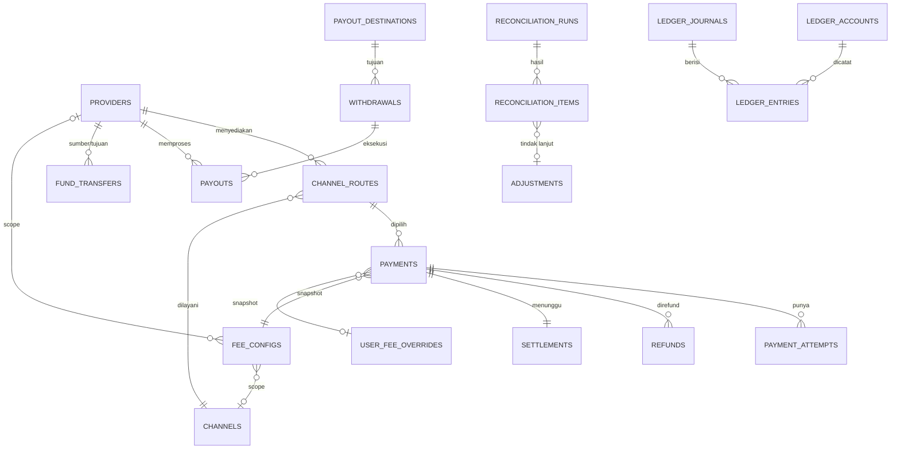

# GePay — Payment, Settlement & Ledger Design

> Dokumen desain untuk platform donasi/content (tipe Saweria/Trakteer/Patreon).
> Fokus: **correct, auditable, immutable, idempotent, provider-agnostic, sederhana**.
> Bukan core banking. Tidak ada fitur yang dibuat hanya karena "terlihat enterprise".

---

## 0. Ringkasan keputusan & koreksi asumsi

Beberapa asumsi di requirement perlu dikoreksi supaya sistemnya benar:

| Asumsi awal                                   | Koreksi                                                                                                                                                                            |
|-----------------------------------------------|------------------------------------------------------------------------------------------------------------------------------------------------------------------------------------|
| "T+2 sudah lewat → transaksi SETTLED"         | **Salah.** T+n hanya *estimasi*. Settlement hanya boleh diakui kalau ada **bukti** (laporan/API/bank statement). Timer hanya memicu *pengecekan*, bukan *posting*.                 |
| "Payment status" saja cukup                   | Status **payment** (uang ditangkap PG) dan status **settlement** (uang pindah ke bank kita) adalah **dua hal berbeda**. Harus dipisah.                                             |
| "Internal balance untuk mencatat hak creator" | Benar, tapi hak creator **tidak langsung bisa ditarik**. Uang baru `available` setelah settlement terkonfirmasi. Sebelum itu `pending`.                                            |
| "Simpan hasil fee (platform_fee = 5000)"      | Kurang. Fee harus disimpan sebagai **konfigurasi berversi** + **snapshot komponen** di transaksi, supaya bisa diaudit "kenapa angkanya begini".                                    |
| "PG fee itu cost platform"                    | Tergantung model bisnis. Default di desain ini: **PG fee di-pass-through ke pembayar** (dibayar di atas nominal). Kalau platform yang menanggung, ada satu baris expense tambahan. |

**Keputusan inti (yang mengikat seluruh desain):**

1. **Ledger adalah satu-satunya sumber kebenaran finansial.** Ledger tidak tahu Midtrans/Flip/donasi — ia hanya tahu
   *account* dan *journal*.
2. **Ledger hanya menerima fakta yang sudah terkonfirmasi.** Fakta settlement butuh `evidence`.
3. **Semua event bisnis → journal yang immutable & idempoten** (dijaga unique key).
4. **Saldo creator = liability**, uangnya secara operasional berada di aset (PG receivable / bank / payout float).
5. **Provider-specific logic hanya ada di payment layer**, tidak pernah di ledger.

---

## 1. Mental model sederhana

Bayangkan tiga lapis:

```
┌─────────────────────────────────────────────────────────────┐
│  BUSINESS / PAYMENT LAYER  (tahu PG, channel, donasi, payout)│
│  - panggil Midtrans/Flip, terima webhook, polling, laporan │
│  - hitung fee, routing channel, kelola status payment/attempt│
│  - settlement & reconciliation (cari bukti)                  │
└───────────────────────────┬─────────────────────────────────┘
                            │ "tolong catat kejadian finansial ini"
                            ▼
┌─────────────────────────────────────────────────────────────┐
│  LEDGER LAYER  (generic, double-entry, buta vendor)          │
│  - accounts (chart of accounts + sub-account)                │
│  - journals + entries (append-only, idempoten, balance)      │
│  - tidak tahu Midtrans, tidak tahu donasi, tidak tahu payout │
└───────────────────────────┬─────────────────────────────────┘
                            ▲
                            │ "inilah bukti" 
┌───────────────────────────┴─────────────────────────────────┐
│  RECONCILIATION LAYER  (pemburu kebenaran)                    │
│  - bandingkan internal vs PG vs bank                         │
│  - menghasilkan bukti / temuan / adjustment                  │
└─────────────────────────────────────────────────────────────┘
```

Analogi developer:

- **Ledger** = database transaksional append-only (seperti event store). Sekali ditulis, tidak diubah.
- **Payment layer** = integration/adaptor (seperti repository per provider). Boleh berubah tiap ganti vendor.
- **Reconciliation** = test/verifikasi berkala yang membandingkan state kita dengan state eksternal.

Prinsip penting soal settlement:

```
Timer T+2  ──►  "waktunya cek"  ──►  cari bukti  ──►  ketemu? ──► posting
                     │                                  │
                     │                                  └─ tidak ketemu → OVERDUE, alert
                     └─ TIDAK PERNAH langsung posting
```

Waktu yang berlalu **tidak membuktikan apa pun**. Yang membuktikan adalah `settlement_evidence`.

---

## 2. Architecture / domain boundary

### 2.1 Modul (Spring Modulith)

Rekomendasi 2 modul:

| Modul     | Tanggung jawab                                                     | Tahu provider? | Tahu PG fee? |
|-----------|--------------------------------------------------------------------|----------------|--------------|
| `ledger`  | accounts, journals, entries, saldo                                 | **Tidak**      | **Tidak**    |
| `payment` | payment, attempt, fee, settlement, payout, funding, reconciliation | **Ya**         | **Ya**       |

- `payment` memanggil `ledger` lewat facade `LedgerApi` (synchronous, in-process).
- `ledger` **tidak boleh** import class `payment`. Boundarya ditegakkan `ModularityTests`.
- Kalau mau lebih sederhana: satu modul `payment` dengan sub-package `ledger`, tapi boundary jadi konvensi, bukan mesin.
  Desain ini memilih **dua modul** karena user minta ledger tidak vendor-locked.

### 2.2 Boundary antar konsep

| Konsep                   | Milik siapa | Isi                                                             | Bukan tugasnya               |
|--------------------------|-------------|-----------------------------------------------------------------|------------------------------|
| **Business Transaction** | `payment`   | niat donasi/pembelian content (nominal, creator, payer)         | mencatat uang                |
| **Payment**              | `payment`   | status pembayaran & snapshot fee                                | settlement                   |
| **Payment Attempt**      | `payment`   | interaksi konkret ke 1 PG (VA, QRIS, redirect) dgn reference PG | ledger                       |
| **Settlement**           | `payment`   | ekspektasi + bukti uang pindah dari PG ke bank                  | rekalkulasi fee              |
| **Ledger Account**       | `ledger`    | "wadah" akuntansi (aset/liabilitas/dll)                         | relasi ke provider           |
| **Journal**              | `ledger`    | 1 kejadian bisnis, seimbang debit=kredit                        | memanggil PG                 |
| **Creator Balance**      | turunan     | saldo akun liability creator                                    | tabel terpisah (cache boleh) |
| **Withdrawal**           | `payment`   | permintaan tarik dana creator                                   | eksekusi transfer            |
| **Payout**               | `payment`   | eksekusi transfer via payout PG                                 | pencatatan ledger            |
| **Fund Transfer**        | `payment`   | pindah dana payin → payout provider                             | income/expense               |
| **Reconciliation**       | `payment`   | cari kebenaran vs eksternal                                     | menebak state                |

**Aturan emas:** PG-specific (`if provider == Midtrans`) **hanya** boleh ada di adapter `payment.integration` dan di
reconciliation parser. Ledger sama sekali tidak boleh tahu provider.

---

## 3. Accounting model

### 3.1 Konsep dasar (versi developer)

- **Debit / Credit** = arah penambahan. Bukan "tambah/kurang". Tiap akun punya *normal balance*.
    - ASSET & EXPENSE: normalnya **DEBIT** (nambah = debit).
    - LIABILITY, EQUITY, REVENUE: normalnya **CREDIT** (nambah = credit).
- **Double-entry** = setiap journal, `SUM(debit) = SUM(credit)`. Kalau tidak seimbang, jangan disimpan.
- **Uang masuk sistem** selalu punya asal. Tidak ada journal yang "berdiri sendiri".

### 3.2 Peta konsep bisnis → akuntansi

| Kejadian bisnis     | Dampak accounting                                                                           |
|---------------------|---------------------------------------------------------------------------------------------|
| Donatur bayar       | Uang ditahan PG → timbul **aset** (piutang ke PG)                                           |
| Donasi diakui       | Hak creator timbul → **liabilitas**; fee platform → **revenue**; PPN → **liabilitas pajak** |
| PG settlement       | Aset pindah bentuk: Piutang PG → **Saldo di akun PG** (belum tentu ke bank)                 |
| Top-up ke payout PG | Aset pindah bentuk: Saldo PG payin → **Float Payout PG**                                    |
| Hak creator cair    | Liabilitas geser: Pending → **Available**                                                   |
| Creator withdraw    | Hold: Available → **Withdrawal Payable**                                                    |
| Payout sukses       | Withdrawal Payable hilang, float payout berkurang, fee → expense/revenue                    |
| Refund              | Balik semua efek di atas                                                                    |

### 3.3 Prinsip pengakuan (revenue recognition)

- **Revenue platform diakui saat payment PAID** (bukan saat settlement). Alasan: jasa sudah diberikan (donasi tersalur),
  dan risiko ditahan lewat mekanisme `pending balance`. Alternatif konservatif: akui saat settlement — lebih aman tapi
  lebih rumit. Desain ini pilih **PAID**, dengan reversal otomatis kalau refund.
- **Hak creator diakui saat PAID, tapi berstatus `pending`.** Baru `available` saat settlement terkonfirmasi (bukti).
  Ini yang melindungi platform dari refund/chargeback setelah creator menarik dana.
- **PPN (VAT) platform fee bukan revenue.** Ia utang ke negara → `VAT Payable`.
- **PG fee**: pada model default (pass-through ke pembayar) ia **tidak masuk ledger sama sekali** — hanya tercatat di
  transaksi untuk rekonsiliasi. Kalau platform menanggung, baru masuk sebagai `PG Fee Expense`.

---

## 4. Chart of Accounts

Daftar akun minimum (bisa ditambah tanpa ubah struktur). Kode akun:

| Kode | Nama                             | Tipe      | Normal | Owner/sub-account            | Description                                                                                                                                                                                                                         |
|------|----------------------------------|-----------|--------|------------------------------|-------------------------------------------------------------------------------------------------------------------------------------------------------------------------------------------------------------------------------------|
| 1100 | PG Clearing Receivable           | ASSET     | DEBIT  | per provider payin           | Piutang ke PG payin: muncul saat donasi PAID (uang sudah ditangkap PG), hilang saat settlement terkonfirmasi dan berpindah ke saldo PG (1150: Payin Provider Balance).                                                              |
| 1150 | Payin Provider Balance           | ASSET     | DEBIT  | per provider payin           | Saldo platform yang sudah settled tapi masih di akun PG payin (mis. Midtrans), dan menjadi sumber dana top-up ke payout provider (1300: Payout Provider Float).                                                                     |
| 1200 | Bank Operating                   | ASSET     | DEBIT  | per rekening bank — opsional | Rekening bank resmi platform, dipakai saat settlement masuk bank (sebelumnya 1100: PG Clearing Receivable) dan sebagai penghubung transfer antar provider (lewat 1400: Fund Transfer In Transit).                                   |
| 1300 | Payout Provider Float            | ASSET     | DEBIT  | per provider payout          | Saldo di payout provider (mis. Flip, Flip Payout) yang siap dipakai mencairkan withdrawal creator (2200: Withdrawal Payable).                                                                                                     |
| 1400 | Fund Transfer In Transit         | ASSET     | DEBIT  | opsional                     | Akun perantara untuk dana yang sudah keluar dari sumber, misalnya bank (1200: Bank Operating), tapi belum tercatat masuk ke tujuan, misalnya payout provider (1300: Payout Provider Float), supaya uang tidak "hilang" dari ledger. |
| 2100 | Creator Payable — Pending        | LIABILITY | CREDIT | per creator                  | Hak creator yang sudah diakui tetapi belum bisa ditarik karena menunggu settlement; setelah settled berpindah ke saldo siap tarik (2110: Creator Payable — Available).                                                              |
| 2110 | Creator Payable — Available      | LIABILITY | CREDIT | per creator                  | Hak creator yang sudah settled dan siap di-withdraw; saat withdrawal diajukan, dana di-hold ke akun penahan (2200: Withdrawal Payable).                                                                                             |
| 2200 | Withdrawal Payable               | LIABILITY | CREDIT | per creator/withdrawal       | Dana creator yang di-hold dari saldo siap tarik (2110: Creator Payable — Available) selama withdrawal diproses; masih milik creator sampai payout sukses.                                                                           |
| 2300 | VAT Payable                      | LIABILITY | CREDIT | global                       | PPN yang dipungut dari fee platform (4000: Platform Fee Revenue); ini utang yang harus disetor ke negara, bukan pendapatan.                                                                                                         |
| 4000 | Platform Fee Revenue             | REVENUE   | CREDIT | global                       | Pendapatan fee platform dari donasi, di luar PPN yang dicatat sebagai utang pajak (2300: VAT Payable).                                                                                                                              |
| 4100 | Withdrawal Fee Revenue           | REVENUE   | CREDIT | global                       | Pendapatan fee platform dari penarikan dana (withdrawal) creator.                                                                                                                                                                   |
| 5000 | Payment Gateway Fee Expense      | EXPENSE   | DEBIT  | global (jika ditanggung)     | Beban fee PG, hanya dipakai kalau platform yang menanggung (bukan pass-through ke pembayar).                                                                                                                                        |
| 5100 | Payout Fee Expense               | EXPENSE   | DEBIT  | global                       | Beban fee provider payout atas proses disbursement/transfer.                                                                                                                                                                        |
| 5150 | Bank / Fund Transfer Fee Expense | EXPENSE   | DEBIT  | global                       | Beban biaya admin/transfer bank saat memindahkan dana antar rekening atau provider (lewat 1400: Fund Transfer In Transit).                                                                                                          |
| 5200 | Refund / Chargeback Loss         | EXPENSE   | DEBIT  | global                       | Kerugian akibat refund atau chargeback yang tidak bisa diklaim ke creator; jika masih bisa ditagih, dicatat sebagai piutang (5300: Creator Negative Balance).                                                                       |
| 5300 | Creator Negative Balance         | ASSET     | DEBIT  | per creator (clawback)       | Piutang platform ke creator akibat refund/chargeback setelah dana ditarik; dipotong dari penghasilan berikutnya.                                                                                                                    |
| 5900 | Fund Transfer Variance           | EXPENSE   | DEBIT  | global                       | Selisih transfer yang tidak bisa dijelaskan oleh fee atau transaksi yang diketahui, yaitu sisa yang tertahan di (1400: Fund Transfer In Transit); dipakai saat posting adjustment.                                                  |

Catatan:

- **`Creator Payable — Pending` vs `Available` sengaja dipisah jadi dua akun.** Ini membuat perpindahan "cair" tetap
  terlihat di general ledger dan query saldo creator jadi sepele. Ini bukan over-engineering — ini justru pengaman
  risiko inti.
- **`1150` adalah titik penting.** Settlement PG umumnya hanya memindahkan uang ke **saldo akun platform di PG**, bukan
  ke rekening bank. Uang baru benar-benar "keluar" dari PG saat di-top-up ke payout PG. `1200 Bank` hanya dipakai kalau
  transfer payin→payout lewat rekening bank (transit), bukan sebagai tujuan akhir.
- Sub-account dibuat *lazy* saat pertama kali creator menerima hak. Kontrol (tanpa owner) dibuat saat seeding.

---

## 5. Database schema & ERD (konseptual)

### 5.1 Schema

- `ledger` — generic accounting, **tanpa FK ke `payment`**.
- `payment` — domain pembayaran, provider, settlement, payout, reconciliation.

`ledger.accounts.owner_ref` bertipe teks (`VARCHAR`) supaya generic (UUID user, BIGINT provider, kode bank, dll) dan
ledger tidak perlu tahu tabel `payment`.

### 5.2 ERD ringkas



Hubungan penting:

- 1 `payment` → banyak `payment_attempts` (retry/expiry buat VA baru).
- 1 `payment` → 1 `settlement` (kita asumsikan settle utuh; refund = transaksi terpisah).
- 1 `withdrawal` → 1..n `payouts` (retry).
- `journals.reference_type/reference_id` = pointer generik ke sumber
  (payment/settlement/withdrawal/payout/fund_transfer). **Tidak ada FK** — ini yang menjaga ledger tetap generic.

### 5.3 Tabel & perannya

| Tabel                          | Peran                                                                |
|--------------------------------|----------------------------------------------------------------------|
| `payment.providers`            | master PG (payin/payout)                                             |
| `payment.channels`             | channel logis (BCA_VA, QRIS, ...) stabil, tidak terikat provider     |
| `payment.channel_routes`       | routing: channel → provider mana + kode provider + limit + prioritas |
| `payment.fee_configs`          | **versi** rate card (platform & PG & payout)                         |
| `payment.user_fee_overrides`   | override per user (VIP), berversi, ber-approval                      |
| `payment.payments`             | transaksi bisnis + snapshot fee + breakdown                          |
| `payment.payment_attempts`     | interaksi konkret ke PG + reference PG                               |
| `payment.settlements`          | ekspektasi & bukti settlement (status terpisah dari payment)         |
| `payment.refunds`              | refund (sebagian/penuh) per payment, idempoten via ref PG            |
| `payment.payout_destinations`  | rekening tujuan creator (snapshot saat withdraw)                     |
| `payment.withdrawals`          | permintaan tarik dana                                                |
| `payment.payouts`              | eksekusi payout per provider + reference                             |
| `payment.fund_transfers`       | pindah dana payin → payout provider (2 leg, auditable)               |
| `payment.adjustments`          | koreksi selisih/temuan (approval + reason) → jurnal ADJUSTMENT       |
| `payment.processed_events`     | inbox idempotency webhook                                            |
| `payment.reconciliation_runs`  | header proses rekonsiliasi                                           |
| `payment.reconciliation_items` | temuan per baris (match/mismatch)                                    |
| `ledger.accounts`              | chart of accounts + sub-account + saldo cache                        |
| `ledger.journals`              | header kejadian finansial (idempoten)                                |
| `ledger.entries`               | baris debit/credit (append-only)                                     |

### 5.4 Aturan ID

- **BIGINT identity** untuk internal/reference: provider, channel, route, fee config, ledger account/journal/entry,
  override.
- **UUID v7** untuk user-facing: payment, attempt, settlement, withdrawal, payout, fund transfer, reconciliation.
- Semua nominal `BIGINT` (rupiah bulat). Tidak ada float.
- Semua rate dalam `*_bps` INT (`1 bps = 0.01%`). Tidak ada `NUMERIC`/float untuk rate.
- Enum disimpan sebagai `VARCHAR` (bukan DB enum type), divalidasi aplikasi.

---

## 6. Fee model

### 6.1 Struktur fee

Fee = `fixed_amount` + (`percentage_bps` × basis) + VAT, di mana VAT dihitung dari (fixed + percentage).

Rumus (integer, pembulatan `HALF_UP`):

```
percentage_amount = round( basis * percentage_bps / 10000 )
subtotal          = fixed_amount + percentage_amount
vat_amount        = round( subtotal * vat_bps / 10000 )
total_fee         = subtotal + vat_amount
```

`basis` = `gross_amount` (nominal donasi murni) untuk fee donasi. (Catatan: PG di dunia nyata kadang menghitung dari
total yang diproses; desain ini sengaja pakai `gross_amount` supaya tidak ada circular dependency. Sesuaikan per
provider di adapter bila perlu.)

### 6.2 Versi, bukan update

`payment.fee_configs` **append-only**. Kalau rate berubah → insert baris baru dengan `effective_from` baru. Baris lama
tidak disentuh.

Contoh:

| id | fee_type          | fixed | pct_bps | vat_bps | effective_from |
|----|-------------------|-------|---------|---------|----------------|
| 10 | PLATFORM_DONATION | 1.000 | 500     | 1100    | 2026-01-01     |
| 20 | PLATFORM_DONATION | 1.500 | 400     | 1100    | 2026-02-01     |

Transaksi Januari mengacu `fee_config_id = 10`; Februari mengacu `20`. Query "config Januari" tetap bisa dijawab walau
sekarang Februari.

### 6.3 Resolusi (default vs override)

Saat payment dibuat:

```
resolve_fee(user_id, fee_type, at):
  1. cari user_fee_overrides(user_id, fee_type) yang aktif pada `at`
     → pilih effective_from terbesar  → SUMBER = override
  2. jika tidak ada, cari fee_configs(fee_type, scope) aktif pada `at`
     → pilih effective_from terbesar  → SUMBER = default
```

- Untuk **platform fee**: scope `provider/channel = NULL`.
- Untuk **PG processing fee**: scope = provider+channel dari `channel_route` terpilih.
- Untuk **payout fee**: scope = provider+channel payout.

### 6.4 Audit fee

Di `payment.payments` disimpan **keduanya**: pointer sumber (`platform_fee_config_id` / `user_fee_override_id`,
`gateway_fee_config_id`) **dan** seluruh komponen hasil hitung. Audit bisa menjawab:

```
user → override/config mana → nilai rate → rumus → komponen → total
```

Bukan cuma `platform_fee = 6660` tanpa penjelasan.

---

## 7. Alur Donation → Payment → Settlement

### Asumsi angka (dipakai konsisten di seluruh dokumen)

```
Donasi (gross_amount, D)              = 100.000

PG fee (ditanggung donatur, di atas):
  fixed                               =   1.000
  percentage  0,7% × 100.000          =     700
  VAT 11% × (1.000+700)               =     187
  total PG fee                        =   1.887

Platform fee (dipotong dari donasi):
  fixed                               =   1.000
  percentage  5% × 100.000            =   5.000
  VAT 11% × (1.000+5.000)             =     660
  total platform fee                  =   6.660

Donatur bayar (total_charged)         = 101.887
Creator terima (net_creator)          = 100.000 - 6.660 = 93.340
Expected settlement dari PG ke bank   = 100.000
```

### 7.1 Saat payment dibuat (belum ada uang)

- Bisnis: donatur membuka halaman donasi, sistem memilih channel (mis. BCA VA) + route PG (Midtrans), hitung fee,
  snapshot.
- Accounting: **belum ada journal.** Belum ada uang, belum ada hak. Hanya state `INITIATED/PENDING`.
- DB: insert `payments` (status `PENDING`, snapshot fee lengkap), insert `payment_attempts` (reference VA).

### 7.2 Payment PAID, belum settlement

- Bisnis: webhook PG bilang customer sudah bayar. Uang **ditahan PG**, belum masuk bank.
- Siapa punya hak/kewajiban:
    - Kita punya **piutang ke Midtrans** 100.000.
    - Creator punya hak 93.340 (belum bisa ditarik).
    - Platform punya revenue 6.000; negara punya hak PPN 660.
- Journal `PAYMENT:{id}:PAID`:

```
DEBIT   1100 PG Clearing Receivable (Midtrans)   100.000
CREDIT  2100 Creator Payable - Pending            93.340
CREDIT  4000 Platform Fee Revenue                  6.000
CREDIT  2300 VAT Payable                             660
```

- DB: `payments.status = PAID`, `paid_at`; `payment_attempts.status = PAID`; insert `settlements` (`EXPECTED`,
  `expected_settlement_date` = estimasi T+n).
- **PG fee 1.887 tidak masuk ledger** (pass-through). Tapi tersimpan di `payments` untuk rekonsiliasi laporan PG (gross
  101.887 − fee 1.887 = net 100.000).

### 7.3 Payment settlement terkonfirmasi

- Bisnis: laporan/API/bank statement membuktikan uang 100.000 sudah **cair ke merchant**, sesuai
  `settlements.settlement_target`:
    - `PROVIDER_BALANCE` → masuk akun **`1150`** (masih di PG, mis. Flip).
    - `BANK` → masuk akun **`1200 Bank`** (mis. Midtrans yang settle ke rekening).
- Journal `SETTLEMENT:{settlement_id}:CONFIRMED` (contoh `PROVIDER_BALANCE`):

```
DEBIT   1150 Payin Provider Balance (Midtrans)   100.000
CREDIT  1100 PG Clearing Receivable (Midtrans)   100.000
```

> Kalau `settlement_target = BANK`, ganti `1150` dengan `1200 Bank Operating`.

- Lalu cairkan hak creator, journal `SETTLEMENT:{settlement_id}:RELEASE`:

```
DEBIT   2100 Creator Payable - Pending           93.340
CREDIT  2110 Creator Payable - Available         93.340
```

- DB: `settlements.status = CONFIRMED`, `actual_amount`, `actual_settled_at`, `settlement_target`, `evidence_source`,
  `external_settlement_id`, `raw_evidence`.
- Setelah ini creator boleh withdraw 93.340. Uangnya secara operasional masih ada di saldo PG payin (`1150`), siap
  di-top-up ke payout PG saat ada withdrawal.

---

## 8. Alur Creator Balance → Withdrawal → Payout

Asumsi creator punya available 500.000, withdraw 500.000, withdrawal fee platform 2.500, payout provider fee 3.000
(ditanggung platform).

### 8.1 Withdraw request (hold)

```
DEBIT   2110 Creator Payable - Available         500.000
CREDIT  2200 Withdrawal Payable                  500.000
```

DB: insert `withdrawals` (`REQUESTED`), snapshot rekening tujuan. Journal key `WITHDRAWAL:{id}:HOLD` — idempoten, tidak
mungkin double-hold.

### 8.2 Funding payout provider (lihat §9)

Dana di saldo PG payin (`1150`) dipindah ke float payout PG (`1300`). Kalau harus lewat rekening bank, jadikan `1200`
hanya sebagai transit (2 jurnal).

```
DEBIT   1300 Payout Provider Float (Flip)      503.000
CREDIT  1150 Payin Provider Balance               503.000
```

### 8.3 Payout sukses

Creator menerima 497.500 (500.000 − 2.500). Provider memotong 3.000 dari float. Float turun 500.500.

```
DEBIT   2200 Withdrawal Payable                  500.000
DEBIT   5100 Payout Fee Expense                    3.000
CREDIT  4100 Withdrawal Fee Revenue                2.500
CREDIT  1300 Payout Provider Float               500.500
```

Check: DEBIT 503.000 = CREDIT 503.000. ✓

DB: `withdrawals.status = PAID`, `payouts.status = COMPLETED`, `provider_reference_id` terisi.

### 8.4 Payout gagal

```
DEBIT   2200 Withdrawal Payable                  500.000
CREDIT  2110 Creator Payable - Available         500.000
```

Dana umumnya **tetap berada di float payout** (gagal kirim, bukan hilang), jadi tidak perlu pergerakan aset — cukup
lepas hold. Kalau dana ditarik balik ke bank: `DEBIT Bank / CREDIT Payout Provider Float`. Kalau provider menagih failed
fee → `DEBIT Payout Fee Expense`. DB: `payouts.status = FAILED`, `failure_code/reason`. Dana creator kembali
`available`, bisa retry.

---

## 9. Multi-PG funding flow (Midtrans → Flip)

### 9.1 Kenyataan operasional: bank adalah rel penghubung

Untuk memindahkan dana **antar provider berbeda** (Midtrans payin → Flip payout), hampir selalu ada **rekening bank
platform di tengah**, karena bank adalah jalur pembayaran bersama. Jadi:

```
Donatur ─► Midtrans ─(settle)─► BANK platform ─(top-up transfer)─► Flip Float ─(payout)─► Creator
            1100                    1200              1300
```

Dua kemungkinan settlement PG:

- `settlement_target = BANK` (umum: Midtrans) → settlement memindahkan `1100 → 1200`.
- `settlement_target = PROVIDER_BALANCE` (mis. Flip) → `1100 → 1150`. Untuk top-up ke provider lain, tetap perlu
  ditarik ke bank dulu.

> Funding hanya **langsung** `1150 → 1300` bila **provider payin dan payout sama** (pindah saldo internal). Lintas
> provider → wajib lewat bank.

### 9.2 Best practice: catat sebagai 2 leg (bukan 1 jurnal)

Transfer bank tidak instan dan bisa gagal/menyimpang. Jadi jangan dianggap 1 kejadian. Pakai akun **
`1400 Fund Transfer In Transit`**:

```
Leg 1 — uang KELUAR dari bank (bukti: mutasi rekening bank)
  DEBIT   1400 Fund Transfer In Transit
  CREDIT  1200 Bank Operating

Leg 2 — uang MASUK ke Flip (bukti: mutasi/top-up record Flip)
  DEBIT   1300 Payout Provider Float
  CREDIT  1400 Fund Transfer In Transit
```

- Selama Leg 2 belum ada, saldo `1400` = uang yang "sedang jalan". Tidak hilang dari ledger, dan **bisa
  direkonsiliasi**.
- Kalau transfer instan & terkonfirmasi bersamaan, tetap tulis 2 leg (atau 1 jurnal gabungan) — yang penting jejaknya
  ada.
- Biaya transfer bank dicatat terpisah: `DEBIT 5150 Bank / Fund Transfer Fee Expense / CREDIT 1200 Bank`.
- Selisih yang masuk (top-up fee provider, pembulatan) → **adjustment** (lihat §9.4).

### 9.3 Tabel `fund_transfers` (diperkaya)

Satu baris `fund_transfers` mewakili SATU niat transfer, dengan dua referensi bukti (`bank_reference`,
`provider_reference`) dan nominal sumber vs tujuan:

| Field                      | Arti                                                                    |
|----------------------------|-------------------------------------------------------------------------|
| `source_type`              | `BANK` atau `PROVIDER_BALANCE` (darimana dana keluar)                   |
| `source_provider_id`       | provider sumber bila `PROVIDER_BALANCE`                                 |
| `target_type`              | `PAYOUT_PROVIDER` atau `BANK`                                           |
| `counterparty_provider_id` | provider tujuan                                                         |
| `sent_amount`              | nominal yang dikirim/keluar dari sumber                                 |
| `fee_amount`               | biaya transfer bank/admin (bukan fee provider payout)                   |
| `received_amount`          | nominal yang benar-benar masuk ke tujuan                                |
| `variance_amount`          | `sent_amount - fee_amount - received_amount` (0 = pas; ≠0 → adjustment) |
| `bank_reference`           | ref mutasi bank (bukti Leg 1)                                           |
| `provider_reference`       | ref top-up di provider (bukti Leg 2)                                    |

### 9.4 Fee transfer vs adjustment (selisih)

Definisi di `fund_transfers`:
`variance_amount = sent_amount - fee_amount - received_amount`.

- **Biaya bank yang jelas** (mis. potong 2.500): masukkan ke `fee_amount` → `variance_amount = 0`, cukup jurnal expense,
  **tidak perlu adjustment**.
- **Selisih tidak terjelaskan** (mis. kirim 503.000, diterima 500.000, tanpa bukti fee): `variance_amount = 3.000` →
  buat **`payment.adjustments`** + jurnal `ADJUSTMENT`.

```text
Kasus fee jelas (variance 0):
  Leg 1:  DEBIT 1400 503.000  / CREDIT 1200 Bank 503.000
  Leg 2:  DEBIT 1300 500.500  / DEBIT 5150 Bank Fee 2.500 / CREDIT 1400 503.000

Kasus selisih tak terjelaskan (variance 3.000):
  Leg 1:  DEBIT 1400 503.000  / CREDIT 1200 Bank 503.000
  Leg 2:  DEBIT 1300 500.000  / CREDIT 1400 500.000
  Adjust: DEBIT 5900 Fund Transfer Variance 3.000 / CREDIT 1400 3.000
          (disertai baris payment.adjustments: reason + approved_by)
```

Aturan: adjustment selalu **jurnal baru** dengan `reference_type = ADJUSTMENT`, `reference_id` = id
`payment.adjustments`. Tidak pernah mengedit jurnal lama. Selama adjustment belum dibuat, saldo `1400` > 0 = tanda "ada
uang belum beres".

**Menjawab "Rp500.000 creator sekarang operasionalnya di mana?"**

Saldo creator adalah **liabilitas**. Uangnya ada di aset. Kita bisa report:

```
Total Creator Payable (Pending + Available)
        harus "di-back" oleh:
  1100 PG Clearing Receivable   (sudah PAID, belum settle)
+ 1150 Payin Provider Balance   (sudah settle, di akun PG)
+ 1300 Payout Provider Float    (sudah top-up, siap disburse)
+ 1200 Bank Operating           (opsional, hanya bila transit)
- 2200 Withdrawal Payable      (sudah disisihkan)
- 2300 VAT Payable
+/- revenue/expense/equity
```

Untuk melacak per creator (uang creator A ada di mana), simpan agregat "sumber dana" sehingga setiap unit liability bisa
ditelusuri ke aset. Minimal, report agregat sudah cukup untuk audit harian.

---

## 10. Refund / failed payout / reversal

### 10.1 Refund sebelum settlement

- Bisnis: donatur minta refund, PG belum settle. Uang masih di piutang PG (`1100`), belum jadi saldo.
- Reversal journal `PAYMENT:{id}:REFUND` (kebalikan §7.2):

```
DEBIT   2100 Creator Payable - Pending           93.340
DEBIT   4000 Platform Fee Revenue                 6.000
DEBIT   2300 VAT Payable                            660
CREDIT  1100 PG Clearing Receivable (Midtrans)   100.000
```

- DB: insert `refunds` (`SUCCEEDED`), `payments.status = REFUNDED`; `settlements.status = CANCELLED`.
- PG fee 1.887 umumnya **tidak kembali** (kebijakan PG). Dicatat sebagai informasi; jika platform menanggung, tambahkan
  `DEBIT 5000 PG Fee Expense / CREDIT ...`.
- Tidak ada uang creator yang perlu ditarik paksa karena belum available.

### 10.2 Refund setelah settlement

Uang sudah ada di **saldo PG payin (`1150`)** (atau sudah top-up ke float payout `1300`); creator available sudah 93.340
(mungkin sudah ditarik). Sisi kas didebit dari akun aset tempat dana berada.

Jika creator belum withdraw:

```
DEBIT   2110 Creator Payable - Available         93.340
DEBIT   4000 Platform Fee Revenue                 6.000
DEBIT   2300 VAT Payable                            660
CREDIT  1150 Payin Provider Balance              100.000
```

Jika creator sudah withdraw (dananya hilang):

```
DEBIT   5300 Creator Negative Balance             93.340   (klawback / piutang ke creator)
DEBIT   4000 Platform Fee Revenue                  6.000
DEBIT   2300 VAT Payable                             660
CREDIT  1150 Payin Provider Balance               100.000
```

Kebijakan: saldo `Available` creator **tidak boleh negatif** untuk penarikan normal. Jika refund memaksa negatif,
pindahkan ke `Creator Negative Balance` dan blokir penarikan berikutnya sampai lunas.

### 10.3 Chargeback / reversal

Mirip refund setelah settlement, tapi inisiatif dari bank/penerbit, dan sering ada **chargeback fee**.

```
DEBIT   5200 Refund / Chargeback Loss            100.000 + fee
CREDIT  1150 Payin Provider Balance              100.000 + fee
CREDIT  5300 Creator Negative Balance            (bagian yang jadi hak creator, untuk diklaim)
```

Catatan: reversal **tidak pernah** mengedit journal lama. Selalu journal baru dengan `reverses_journal_id`.

### 10.4 Payout gagal

Sudah dijelaskan §8.4. Poin penting: hold dilepas, dana creator kembali `Available`, dan `payouts` menyimpan alasan
gagal.

---

## 11. Reconciliation

Prinsip: **rekonsiliasi mencari kebenaran, bukan menebak.** Scheduler hanya pemicu; kesimpulan harus dari perbandingan
data eksternal.

### 11.1 Jenis rekonsiliasi

| Jenis         | Internal                | Eksternal                              | Cocokkan dengan                  |
|---------------|-------------------------|----------------------------------------|----------------------------------|
| Payment       | `payments`/`attempts`   | report transaksi PG                    | `provider_reference_id`          |
| Settlement    | `settlements`           | laporan settlement PG / bank statement | `external_settlement_id` / batch |
| Payout        | `withdrawals`/`payouts` | disbursement report + mutasi bank      | `provider_reference_id`          |
| Fund transfer | `fund_transfers`        | mutasi bank + top-up provider          | 2 reference                      |
| Ledger        | `entries`               | `accounts.balance`                     | recompute `SUM`                  |

### 11.2 Menangani PG tanpa settlement webhook

```
1. Saat PAID → buat settlements(status=EXPECTED, expected_settlement_date=estimasi T+n)
2. Scheduler berkala:
   a. ambil settlements EXPECTED/OVERDUE yang due
   b. coba dapatkan bukti:
      - API laporan/settlement (bila ada)
      - import file laporan settlement
      - import mutasi bank (bank statement)
      - input manual oleh finance (evidence_source=MANUAL)
   c. bila ketemu  → CONFIRMED  → posting journal settlement + release creator
      bila tidak   → status OVERDUE, alert, TETAP tidak posting
3. Setiap temuan/langkah dicatat ke reconciliation_items
```

- **Settlement terlambat**: tetap `OVERDUE`. Dana creator tetap `pending`. Ini benar secara risiko.
- **Settlement date berubah**: update `expected_settlement_date` (audited via `reconciliation_items`/`updated_at`).
  Tetap tidak posting.
- **Refund sebelum settlement**: `settlements.status = CANCELLED`, reversal journal.
- **State internal beda dengan PG**: jangan overwrite diam-diam. Buat `reconciliation_item` (`MISMATCH`/`MISSING_*`),
  investigasi, lalu bila perlu posting adjustment journal (idempoten) dengan `reference_type = ADJUSTMENT`.

### 11.3 Simulasi temuan

- **PG PAID, internal belum** (webhook hilang): recon menemukan transaksi ada di report PG. Ingest event → posting
  `PAYMENT:...:PAID` idempoten (aman walau nanti webhook telat datang).
- **Internal PAID, PG tidak ada**: curiga webhook palsu. Jangan settle, alert, tahan creator funds.
- **Amount mismatch** (PG motong fee ekstra): `variance_amount` di settlement; selisih diakui
  `DEBIT 5000 PG Fee Expense`.
- **Ledger tidak balance**: `RunType=LEDGER` gagal → stop, alert, jangan lanjut operasi finansial sampai dibetulkan.

---

## 12. Invariant dan rules yang wajib dijaga

**Ledger**

1. `SUM(debit) = SUM(credit)` untuk setiap journal. Ditegakkan di service; opsional trigger.
2. Entries & journals **append-only** — tidak ada `UPDATE`/`DELETE` (revoke privilege role aplikasi).
3. Koreksi hanya via journal baru dengan `reverses_journal_id`.
4. `journals.idempotency_key` **UNIQUE** → satu event tidak mungkin posting dua kali.
5. `accounts.balance` = recomputable dari `entries`; harus konsisten (dicek rekonsiliasi ledger).
6. Sub-account unik per `(code, owner_ref)`.

**Payment / settlement / payout**

7. `payments.status` **tidak boleh** di-set `SETTLED` (tidak ada status itu). Settlement adalah entitas terpisah.
8. Posting settlement **hanya** jika ada bukti (`settlements` CONFIRMED + evidence). Tidak ada posting dari timer.
9. `net_creator_amount + platform_fee_amount + VAT = expected_settlement_amount` (model pass-through). Dicek saat
   create.
10. Snapshot fee immutable: perubahan `fee_configs`/override **tidak** mengubah payment lama.
11. `channel_route` + `provider_reference_id` unik → webhook tidak dobel.
12. `processed_events` unik per `(provider, external_event_id)` → inbox idempoten.

**Balance / withdrawal**

13. `Creator Payable - Available` **tidak boleh negatif** untuk operasi normal.
14. Withdraw hanya dari `Available`; saat hold, saldo berpindah ke `Withdrawal Payable`.
15. Payout gagal → dana kembali ke `Available`.
16. Dana `Pending` **tidak bisa** di-withdraw.

**Provider-agnostic**

17. `ledger` tidak boleh mengandung logika/atribut provider.
18. Mengganti Midtrans → provider baru = tambah `providers`/`channel_routes` + adapter. Nol perubahan ledger.

**Data**

19. Semua nominal `BIGINT` (rupiah bulat), semua rate `INT` bps.
20. Semua journal punya `occurred_at` (business time) selain `created_at` (system time).
21. External reference pada attempts/payouts/settlements disimpan apa adanya + `raw_payload` JSONB untuk audit.

---

## 13. PostgreSQL DDL

> Butuh PostgreSQL 15+ untuk `UNIQUE NULLS NOT DISTINCT`.
> Konvensi: BIGINT identity untuk internal, UUID v7 untuk user-facing, `TIMESTAMPTZ` untuk waktu.

```sql
CREATE SCHEMA IF NOT EXISTS ledger;
CREATE SCHEMA IF NOT EXISTS payment;

-- =====================================================================
-- LEDGER (generic, tanpa FK ke payment)
-- =====================================================================

-- Daftar akun (chart of accounts) + sub-account per owner. Ini "wadah" saldo.
-- Kontrol (2300,4000,...) owner NULL; sub-account owner_ref diisi (user/provider).
CREATE TABLE ledger.accounts
(
    id             BIGINT GENERATED ALWAYS AS IDENTITY PRIMARY KEY,
    code           VARCHAR(20)  NOT NULL,               -- kode akun, mis. '1100' (lihat Chart of Accounts)
    name           VARCHAR(120) NOT NULL,               -- nama tampil akun
    type           VARCHAR(10)  NOT NULL,               -- ASSET | LIABILITY | EQUITY | REVENUE | EXPENSE
    normal_balance VARCHAR(6)   NOT NULL,               -- DEBIT | CREDIT (arah saldo bertambah)
    owner_type     VARCHAR(24),                         -- CREATOR | PAYMENT_PROVIDER | PAYOUT_PROVIDER | BANK | NULL
    owner_ref      VARCHAR(64),                         -- UUID user / id provider / kode bank (generic text)
    currency       CHAR(3)      NOT NULL DEFAULT 'IDR', -- hanya IDR (single currency)
    balance        BIGINT       NOT NULL DEFAULT 0,     -- saldo diarah normal, cache dari entries
    version        BIGINT       NOT NULL DEFAULT 0,     -- optimistic lock; naik tiap update saldo
    is_active      BOOLEAN      NOT NULL DEFAULT TRUE,
    created_at     TIMESTAMPTZ  NOT NULL DEFAULT now(),
    updated_at     TIMESTAMPTZ  NOT NULL DEFAULT now(),
    CONSTRAINT ux_accounts_code_owner UNIQUE NULLS NOT DISTINCT (code, owner_type, owner_ref)
);
CREATE INDEX ix_accounts_owner ON ledger.accounts (owner_type, owner_ref);

-- Header 1 kejadian finansial. `idempotency_key` mencegah 1 event diposting 2x.
-- TIDAK pernah di-UPDATE/DELETE; koreksi lewat journal baru (`reverses_journal_id`).
CREATE TABLE ledger.journals
(
    id                  BIGINT GENERATED ALWAYS AS IDENTITY PRIMARY KEY,
    idempotency_key     VARCHAR(160) NOT NULL,                  -- mis. 'payment:PAY-1:paid' (unik)
    reference_type      VARCHAR(40)  NOT NULL,                  -- PAYMENT | SETTLEMENT | WITHDRAWAL | PAYOUT
    -- | FUND_TRANSFER | REFUND | ADJUSTMENT
    reference_id        VARCHAR(64)  NOT NULL,                  -- id sumber (pay-1/set-1/wd-1/...), teks generic
    description         VARCHAR(240) NOT NULL,                  -- teks untuk manusia, bukan untuk agregasi
    occurred_at         TIMESTAMPTZ  NOT NULL,                  -- waktu bisnis kejadian (beda dengan created_at)
    reverses_journal_id BIGINT REFERENCES ledger.journals (id), -- diisi kalau ini jurnal koreksi
    created_at          TIMESTAMPTZ  NOT NULL DEFAULT now(),    -- waktu sistem mencatat
    CONSTRAINT ux_journals_idem UNIQUE (idempotency_key)
);
CREATE INDEX ix_journals_ref ON ledger.journals (reference_type, reference_id);

-- Baris debit/credit. 1 journal harus punya >=2 baris dan SUM(DEBIT)=SUM(CREDIT).
-- Append-only; `amount` selalu positif, arah ditentukan `direction`.
CREATE TABLE ledger.entries
(
    id         BIGINT GENERATED ALWAYS AS IDENTITY PRIMARY KEY,
    journal_id BIGINT      NOT NULL REFERENCES ledger.journals (id),
    account_id BIGINT      NOT NULL REFERENCES ledger.accounts (id),
    direction  VARCHAR(6)  NOT NULL CHECK (direction IN ('DEBIT', 'CREDIT')),
    amount     BIGINT      NOT NULL CHECK (amount > 0), -- nominal IDR (bulat, > 0)
    created_at TIMESTAMPTZ NOT NULL DEFAULT now()
);
CREATE INDEX ix_entries_journal ON ledger.entries (journal_id);
CREATE INDEX ix_entries_account ON ledger.entries (account_id, id);

-- =====================================================================
-- PAYMENT — master & routing
-- =====================================================================

-- Master payment gateway / disbursement provider. Satu baris = satu vendor (Midtrans, Flip, ...).
CREATE TABLE payment.providers
(
    id              BIGINT GENERATED ALWAYS AS IDENTITY PRIMARY KEY,
    code            VARCHAR(30)  NOT NULL,               -- MIDTRANS | Flip | DOKU | ...
    name            VARCHAR(100) NOT NULL,
    supports_payin  BOOLEAN      NOT NULL DEFAULT FALSE, -- bisa terima pembayaran?
    supports_payout BOOLEAN      NOT NULL DEFAULT FALSE, -- bisa kirim dana/withdrawal?
    is_active       BOOLEAN      NOT NULL DEFAULT TRUE,
    created_at      TIMESTAMPTZ  NOT NULL DEFAULT now(),
    updated_at      TIMESTAMPTZ  NOT NULL DEFAULT now(),
    CONSTRAINT ux_providers_code UNIQUE (code)
);

-- Seeder provider awal (idempoten).
INSERT INTO payment.providers (code, name, supports_payin, supports_payout)
VALUES ('MIDTRANS', 'Midtrans', TRUE, FALSE),
       ('Flip', 'Flip', FALSE, TRUE)
ON CONFLICT ON CONSTRAINT ux_providers_code DO NOTHING;

-- Channel logis yang stabil & tidak terikat provider. FE/API merujuk ke sini, bukan ke PG.
CREATE TABLE payment.channels
(
    id           BIGINT GENERATED ALWAYS AS IDENTITY PRIMARY KEY,
    code         VARCHAR(40)  NOT NULL, -- BCA_VA | QRIS | GOPAY | BANK_BCA
    display_name VARCHAR(120) NOT NULL, -- teks yang dilihat pembayar, mis. 'Transfer BCA Virtual Account'
    type         VARCHAR(20)  NOT NULL, -- VA | QRIS | EWALLET | BANK_TRANSFER | PAYOUT_BANK | PAYOUT_EWALLET
    direction    VARCHAR(10)  NOT NULL, -- PAYIN (masuk) | PAYOUT (keluar)
    is_active    BOOLEAN      NOT NULL DEFAULT TRUE,
    created_at   TIMESTAMPTZ  NOT NULL DEFAULT now(),
    CONSTRAINT ux_channels_code UNIQUE (code)
);

-- Seeder channel awal (idempoten).
INSERT INTO payment.channels (code, display_name, type, direction)
VALUES ('BCA_VA', 'Transfer BCA Virtual Account', 'VA', 'PAYIN'),
       ('QRIS', 'QRIS', 'QRIS', 'PAYIN'),
       ('BANK_BCA', 'Transfer Bank BCA', 'PAYOUT_BANK', 'PAYOUT')
ON CONFLICT ON CONSTRAINT ux_channels_code DO NOTHING;

-- Routing: channel logis mana dilayani provider mana, pakai kode provider apa.
-- Nambah PG/channel = insert baris, TANPA ubah kode atau tabel lain.
CREATE TABLE payment.channel_routes
(
    id                    BIGINT GENERATED ALWAYS AS IDENTITY PRIMARY KEY,
    provider_id           BIGINT      NOT NULL REFERENCES payment.providers (id),
    channel_id            BIGINT      NOT NULL REFERENCES payment.channels (id),
    provider_channel_code VARCHAR(60) NOT NULL,             -- kode spesifik milik PG utk channel ini
    min_amount            BIGINT      NOT NULL DEFAULT 0,   -- batas bawah nominal
    max_amount            BIGINT      NOT NULL DEFAULT 0,   -- 0 = tanpa batas atas
    priority              INT         NOT NULL DEFAULT 100, -- kecil = diprioritaskan saat failover
    is_active             BOOLEAN     NOT NULL DEFAULT TRUE,
    created_at            TIMESTAMPTZ NOT NULL DEFAULT now(),
    updated_at            TIMESTAMPTZ NOT NULL DEFAULT now(),
    CONSTRAINT ux_routes_provider_channel UNIQUE (provider_id, channel_id)
);

-- Seeder routing awal (idempoten, pakai subquery karena id provider/channel auto-generate).
INSERT INTO payment.channel_routes
(provider_id, channel_id, provider_channel_code, min_amount, max_amount, priority)
SELECT p.id, c.id, v.provider_channel_code, v.min_amount, v.max_amount, v.priority
FROM (VALUES ('MIDTRANS', 'BCA_VA', 'VA_BCA', 10000::BIGINT, 0::BIGINT, 100),
             ('Flip', 'QRIS', 'QRIS', 10000, 0, 100),
             ('Flip', 'BANK_BCA', 'BCA', 10000, 0, 100)) AS v(provider_code, channel_code, provider_channel_code,
                                                                min_amount, max_amount, priority)
         JOIN payment.providers p ON p.code = v.provider_code
         JOIN payment.channels c ON c.code = v.channel_code
ON CONFLICT ON CONSTRAINT ux_routes_provider_channel DO NOTHING;

-- =====================================================================
-- PAYMENT — fee (versi)
-- =====================================================================

-- Rate card BERVERSI. Insert baris BARU tiap rate berubah; JANGAN update baris lama.
-- `effective_from` = kapan mulai berlaku; `effective_to` NULL = masih berlaku.
CREATE TABLE payment.fee_configs
(
    id             BIGINT GENERATED ALWAYS AS IDENTITY PRIMARY KEY,
    fee_type       VARCHAR(30) NOT NULL,                     -- PLATFORM_DONATION | PLATFORM_CONTENT
    -- | PLATFORM_WITHDRAWAL | GATEWAY_PROCESSING | PAYOUT
    provider_id    BIGINT REFERENCES payment.providers (id), -- diisi utk GATEWAY_PROCESSING/PAYOUT
    channel_id     BIGINT REFERENCES payment.channels (id),  -- diisi utk GATEWAY_PROCESSING/PAYOUT
    fixed_amount   BIGINT      NOT NULL DEFAULT 0,           -- nominal tetap (IDR)
    percentage_bps INT         NOT NULL DEFAULT 0,           -- persen dalam bps (500 = 5%)
    vat_bps        INT         NOT NULL DEFAULT 0,           -- PPN atas (fixed+percentage), 1100 = 11%
    effective_from TIMESTAMPTZ NOT NULL,
    effective_to   TIMESTAMPTZ,                              -- NULL = berlaku terus
    note           VARCHAR(240),
    created_by     VARCHAR(64),
    created_at     TIMESTAMPTZ NOT NULL DEFAULT now(),
    CONSTRAINT ck_fee_scope CHECK (
        (fee_type IN ('PLATFORM_DONATION', 'PLATFORM_CONTENT', 'PLATFORM_WITHDRAWAL')
            AND provider_id IS NULL AND channel_id IS NULL)
            OR fee_type IN ('GATEWAY_PROCESSING', 'PAYOUT')
        ),
    CONSTRAINT ck_fee_rates CHECK (
        fixed_amount >= 0 AND percentage_bps >= 0 AND vat_bps >= 0
            AND percentage_bps <= 10000 AND vat_bps <= 10000
        )
);
CREATE INDEX ix_fee_configs_lookup
    ON payment.fee_configs (fee_type, provider_id, channel_id, effective_from DESC);

-- Seeder fee default (idempoten). Ganti rate = insert baris baru, bukan update baris ini.
INSERT INTO payment.fee_configs
(fee_type, provider_id, channel_id, fixed_amount, percentage_bps, vat_bps, effective_from, note)
SELECT v.fee_type,
       p.id,
       c.id,
       v.fixed_amount,
       v.percentage_bps,
       v.vat_bps,
       v.effective_from,
       v.note
FROM (VALUES ('PLATFORM_DONATION', NULL, NULL, 1000::BIGINT, 500, 1100, TIMESTAMPTZ '2026-01-01 00:00:00+07',
              'Platform fee donasi default'),
             ('PLATFORM_CONTENT', NULL, NULL, 1000, 500, 1100, TIMESTAMPTZ '2026-01-01 00:00:00+07',
              'Platform fee content default'),
             ('PLATFORM_WITHDRAWAL', NULL, NULL, 2500, 0, 0, TIMESTAMPTZ '2026-01-01 00:00:00+07',
              'Withdrawal fee default'),
             ('GATEWAY_PROCESSING', 'MIDTRANS', 'BCA_VA', 1000, 70, 1100, TIMESTAMPTZ '2026-01-01 00:00:00+07',
              'Midtrans BCA VA'),
             ('PAYOUT', 'Flip', 'BANK_BCA', 3000, 0, 0, TIMESTAMPTZ '2026-01-01 00:00:00+07',
              'Flip BCA payout')) AS v(fee_type, provider_code, channel_code, fixed_amount, percentage_bps, vat_bps,
                                         effective_from, note)
         LEFT JOIN payment.providers p ON p.code = v.provider_code
         LEFT JOIN payment.channels c ON c.code = v.channel_code
WHERE NOT EXISTS (SELECT 1
                  FROM payment.fee_configs f
                  WHERE f.fee_type = v.fee_type
                    AND f.effective_from = v.effective_from
                    AND f.provider_id IS NOT DISTINCT FROM p.id
                    AND f.channel_id IS NOT DISTINCT FROM c.id);

-- Override fee per user (VIP). Lebih diprioritaskan dari fee_configs saat resolve.
-- Insert baris BARU tiap perubahan; ada `reason` + `approved_by` untuk audit.
CREATE TABLE payment.user_fee_overrides
(
    id             BIGINT GENERATED ALWAYS AS IDENTITY PRIMARY KEY,
    user_id        UUID         NOT NULL,
    fee_type       VARCHAR(30)  NOT NULL, -- PLATFORM_DONATION | PLATFORM_CONTENT
    -- | PLATFORM_WITHDRAWAL
    fixed_amount   BIGINT       NOT NULL DEFAULT 0,
    percentage_bps INT          NOT NULL DEFAULT 0,
    vat_bps        INT          NOT NULL DEFAULT 0,
    effective_from TIMESTAMPTZ  NOT NULL,
    effective_to   TIMESTAMPTZ,
    reason         VARCHAR(300) NOT NULL,
    approved_by    UUID         NOT NULL,
    created_at     TIMESTAMPTZ  NOT NULL DEFAULT now(),
    CONSTRAINT ck_override_rates CHECK (
        fixed_amount >= 0 AND percentage_bps >= 0 AND vat_bps >= 0
            AND percentage_bps <= 10000 AND vat_bps <= 10000
        )
);
CREATE INDEX ix_user_fee_overrides_lookup
    ON payment.user_fee_overrides (user_id, fee_type, effective_from DESC);

-- =====================================================================
-- PAYMENT — transaksi & attempt
-- =====================================================================

-- Niat transaksi bisnis (donasi/content) + SNAPSHOT fee. 1 payment bisa punya banyak attempt.
-- Fee TIDAK dihitung ulang saat webhook; semua komponen disimpan di sini untuk audit.
CREATE TABLE payment.payments
(
    id                             UUID PRIMARY KEY,                                             -- UUID v7, id yang tampil ke user
    idempotency_key                VARCHAR(160) NOT NULL,                                        -- kunci cegah donasi dobel dari 1 request
    type                           VARCHAR(20)  NOT NULL,                                        -- DONATION | CONTENT_PURCHASE
    status                         VARCHAR(20)  NOT NULL,                                        -- INITIATED | PENDING | PAID | EXPIRED
    -- | FAILED | CANCELLED
    -- | PARTIALLY_REFUNDED | REFUNDED
    user_id                     UUID         NOT NULL,                                        -- user PENERIMA hak (payee); identity.users.id
    payer_id                       UUID,                                                         -- user PEMBAYAR; NULL = anonim; identity.users.id
    channel_id                     BIGINT       NOT NULL REFERENCES payment.channels (id),       -- channel logis
    channel_route_id               BIGINT       NOT NULL REFERENCES payment.channel_routes (id), -- PG terpilih (snapshot)
    gross_amount                   BIGINT       NOT NULL CHECK (gross_amount > 0),               -- nominal donasi murni

    -- snapshot fee PG (pass-through; tidak masuk ledger, hanya untuk rekonsiliasi)
    gateway_fee_config_id          BIGINT REFERENCES payment.fee_configs (id),                   -- config PG yang dipakai
    pg_fixed_fee_amount            BIGINT       NOT NULL DEFAULT 0,
    pg_percentage_fee_bps          INT          NOT NULL DEFAULT 0,
    pg_percentage_fee_amount       BIGINT       NOT NULL DEFAULT 0,
    pg_vat_bps                     INT          NOT NULL DEFAULT 0,
    pg_vat_amount                  BIGINT       NOT NULL DEFAULT 0,
    pg_fee_amount                  BIGINT       NOT NULL DEFAULT 0,                              -- total = fixed + pct + vat

    -- snapshot fee platform
    platform_fee_config_id         BIGINT REFERENCES payment.fee_configs (id),                   -- dipakai kalau tanpa override
    user_fee_override_id           BIGINT REFERENCES payment.user_fee_overrides (id),            -- menang kalau ada
    platform_fixed_fee_amount      BIGINT       NOT NULL DEFAULT 0,
    platform_percentage_fee_bps    INT          NOT NULL DEFAULT 0,
    platform_percentage_fee_amount BIGINT       NOT NULL DEFAULT 0,
    platform_vat_bps               INT          NOT NULL DEFAULT 0,
    platform_vat_amount            BIGINT       NOT NULL DEFAULT 0,
    platform_fee_amount            BIGINT       NOT NULL DEFAULT 0,                              -- total = fixed + pct + vat

    total_charged_amount           BIGINT       NOT NULL,                                        -- dibayar pembayar (gross + pg fee)
    net_creator_amount             BIGINT       NOT NULL,                                        -- hak creator (gross - platform fee)
    expected_settlement_amount     BIGINT       NOT NULL,                                        -- uang yang diharap settle dari PG

    metadata                       JSONB,                                                        -- data bebas (content_id, pesan donasi, ...)
    version                        BIGINT       NOT NULL DEFAULT 0,                              -- optimistic lock
    created_at                     TIMESTAMPTZ  NOT NULL DEFAULT now(),
    updated_at                     TIMESTAMPTZ  NOT NULL DEFAULT now(),
    paid_at                        TIMESTAMPTZ,                                                  -- diisi saat webhook PAID
    expired_at                     TIMESTAMPTZ,                                                  -- diisi saat expired/cancelled
    CONSTRAINT ux_payments_idem UNIQUE (idempotency_key),
    CONSTRAINT ck_platform_fee_source
        CHECK (platform_fee_config_id IS NULL OR user_fee_override_id IS NULL),
    CONSTRAINT ck_payment_amounts CHECK (
        total_charged_amount = gross_amount + pg_fee_amount
            AND net_creator_amount = gross_amount - platform_fee_amount
            AND expected_settlement_amount = gross_amount
        )
);
CREATE INDEX ix_payments_creator ON payment.payments (user_id, id DESC);
CREATE INDEX ix_payments_status ON payment.payments (status, id DESC);
CREATE INDEX ix_payments_created ON payment.payments (created_at DESC);

-- Interaksi konkret ke 1 PG. Satu payment bisa retry/expire → banyak attempt.
-- Reuse attempt AKTIF supaya pembayar balik ke tab tetap lihat VA/QRIS yang sama.
CREATE TABLE payment.payment_attempts
(
    id                       UUID PRIMARY KEY,
    payment_id               UUID        NOT NULL REFERENCES payment.payments (id),
    channel_route_id         BIGINT      NOT NULL REFERENCES payment.channel_routes (id),
    provider_reference_id    VARCHAR(120),         -- id/order_id dari sisi PG (dipakai matching webhook)
    payment_reference_number VARCHAR(120),         -- nomor VA / RRN / link yang ditampilkan ke PEMBAYAR
    status                   VARCHAR(20) NOT NULL, -- INITIATED | PENDING | PAID | EXPIRED | FAILED
    expires_at               TIMESTAMPTZ,          -- kedaluwarsa attempt; lewat ini boleh bikin baru
    raw_request              JSONB,                -- request kita ke PG (bukti audit)
    raw_response             JSONB,                -- response PG (bukti audit)
    created_at               TIMESTAMPTZ NOT NULL DEFAULT now(),
    updated_at               TIMESTAMPTZ NOT NULL DEFAULT now(),
    CONSTRAINT ux_attempts_provider_ref UNIQUE (channel_route_id, provider_reference_id)
);
CREATE INDEX ix_attempts_payment ON payment.payment_attempts (payment_id);
CREATE INDEX ix_attempts_ref_number
    ON payment.payment_attempts (payment_reference_number)
    WHERE payment_reference_number IS NOT NULL;
-- Menjamin 1 payment hanya punya 1 attempt AKTIF per route; untuk reuse VA/QRIS saat
-- pembayar balik tanpa bikin attempt baru. Attempt lama yang sudah EXPIRED boleh punya baru.
CREATE UNIQUE INDEX ux_attempts_active
    ON payment.payment_attempts (payment_id, channel_route_id)
    WHERE status IN ('INITIATED', 'PENDING');

-- =====================================================================
-- PAYMENT — settlement (status terpisah dari payment)
-- =====================================================================

-- Ekspektasi + BUKTI settlement. Terpisah dari status payment.
-- `expected_*` hanya estimasi; status baru CONFIRMED setelah ada `evidence_*`.
CREATE TABLE payment.settlements
(
    id                       UUID PRIMARY KEY,
    payment_id               UUID        NOT NULL REFERENCES payment.payments (id), -- 1 payment = 1 settlement
    provider_id              BIGINT      NOT NULL REFERENCES payment.providers (id),
    status                   VARCHAR(20) NOT NULL,                                  -- EXPECTED | OVERDUE | CONFIRMED | CANCELLED
    expected_amount          BIGINT      NOT NULL,                                  -- net yang kita HARAP diterima
    expected_settlement_date DATE        NOT NULL,                                  -- ESTIMASI T+n, bukan bukti; hanya pemicu pengecekan
    settlement_target        VARCHAR(20),                                           -- BANK | PROVIDER_BALANCE (default: PROVIDER_BALANCE)
    actual_amount            BIGINT,                                                -- jumlah yang BENAR-BENAR masuk (dari bukti)
    actual_settled_at        TIMESTAMPTZ,
    variance_amount          BIGINT,                                                -- = actual_amount - expected_amount
    --   >0 kelebihan, <0 kekurangan (mis. potongan fee tambahan)
    external_settlement_id   VARCHAR(120),                                          -- id batch/settlement dari PG (kalau ada)
    evidence_source          VARCHAR(30),                                           -- API | REPORT_FILE | BANK_STATEMENT | MANUAL
    evidence_reference       VARCHAR(200),
    raw_evidence             JSONB,
    confirmed_at             TIMESTAMPTZ,
    created_at               TIMESTAMPTZ NOT NULL DEFAULT now(),
    updated_at               TIMESTAMPTZ NOT NULL DEFAULT now(),
    CONSTRAINT ux_settlements_payment UNIQUE (payment_id)
);
CREATE INDEX ix_settlements_due ON payment.settlements (status, expected_settlement_date);
CREATE INDEX ix_settlements_external
    ON payment.settlements (provider_id, external_settlement_id)
    WHERE external_settlement_id IS NOT NULL;

-- =====================================================================
-- PAYMENT — refund (bisa sebagian, bisa banyak per payment)
-- =====================================================================

-- Refund penuh/sebagian. Boleh banyak baris per payment (partial refund).
-- Diproses sebagai jurnal baru (koreksi), BUKAN edit jurnal lama.
CREATE TABLE payment.refunds
(
    id                    UUID PRIMARY KEY,
    payment_id            UUID        NOT NULL REFERENCES payment.payments (id),
    provider_id           BIGINT      NOT NULL REFERENCES payment.providers (id),
    status                VARCHAR(20) NOT NULL,                    -- REQUESTED | PROCESSING | SUCCEEDED | FAILED
    amount                BIGINT      NOT NULL CHECK (amount > 0), -- nominal refund (<= total dibayar)
    reason                VARCHAR(240),
    provider_reference_id VARCHAR(120),                            -- id refund dari PG
    raw_payload           JSONB,
    created_at            TIMESTAMPTZ NOT NULL DEFAULT now(),
    completed_at          TIMESTAMPTZ,
    CONSTRAINT ux_refunds_provider_ref UNIQUE (provider_id, provider_reference_id)
);
CREATE INDEX ix_refunds_payment ON payment.refunds (payment_id, id DESC);

-- =====================================================================
-- PAYMENT — withdrawal & payout
-- =====================================================================

-- Rekening tujuan milik creator. Saat withdraw, datanya di-SNAPSHOT ke withdrawals.
CREATE TABLE payment.payout_destinations
(
    id             UUID PRIMARY KEY,
    user_id     UUID         NOT NULL,                                  -- pemilik rekening (identity.users.id)
    channel_id     BIGINT       NOT NULL REFERENCES payment.channels (id), -- channel payout (mis. BANK_BCA)
    account_number VARCHAR(40)  NOT NULL,
    account_name   VARCHAR(120) NOT NULL,
    bank_code      VARCHAR(20),
    is_default     BOOLEAN      NOT NULL DEFAULT FALSE,
    is_active      BOOLEAN      NOT NULL DEFAULT TRUE,
    created_at     TIMESTAMPTZ  NOT NULL DEFAULT now(),
    updated_at     TIMESTAMPTZ  NOT NULL DEFAULT now()
);
CREATE INDEX ix_payout_destinations_creator ON payment.payout_destinations (user_id);

-- Permintaan tarik dana creator. Saat dibuat: saldo available di-hold (lihat jurnal HOLD).
CREATE TABLE payment.withdrawals
(
    id                         UUID PRIMARY KEY,
    idempotency_key            VARCHAR(160) NOT NULL,                                        -- cegah double request
    user_id                 UUID         NOT NULL,
    destination_id             UUID         NOT NULL REFERENCES payment.payout_destinations (id),
    channel_route_id           BIGINT       NOT NULL REFERENCES payment.channel_routes (id), -- PG payout terpilih
    status                     VARCHAR(20)  NOT NULL,                                        -- REQUESTED | PROCESSING | PAID
    -- | FAILED | CANCELLED | REJECTED
    requested_amount           BIGINT       NOT NULL CHECK (requested_amount > 0),           -- dipotong dari available
    withdrawal_fee_amount      BIGINT       NOT NULL DEFAULT 0,                              -- fee platform
    net_disbursement_amount    BIGINT       NOT NULL,                                        -- yang diterima creator = requested - fee
    destination_account_number VARCHAR(40)  NOT NULL,                                        -- snapshot tujuan
    destination_account_name   VARCHAR(120) NOT NULL,                                        -- snapshot tujuan
    destination_bank_code      VARCHAR(20),                                                  -- snapshot tujuan
    created_at                 TIMESTAMPTZ  NOT NULL DEFAULT now(),
    updated_at                 TIMESTAMPTZ  NOT NULL DEFAULT now(),
    completed_at               TIMESTAMPTZ,
    CONSTRAINT ux_withdrawals_idem UNIQUE (idempotency_key),
    CONSTRAINT ck_withdrawal_net
        CHECK (net_disbursement_amount = requested_amount - withdrawal_fee_amount)
);
CREATE INDEX ix_withdrawals_creator ON payment.withdrawals (user_id, id DESC);
CREATE INDEX ix_withdrawals_status ON payment.withdrawals (status, id DESC);

-- Eksekusi disbursement ke payout provider. 1 withdrawal bisa retry (banyak payout).
CREATE TABLE payment.payouts
(
    id                    UUID PRIMARY KEY,
    withdrawal_id         UUID        NOT NULL REFERENCES payment.withdrawals (id),
    provider_id           BIGINT      NOT NULL REFERENCES payment.providers (id),
    status                VARCHAR(20) NOT NULL,           -- PENDING | COMPLETED | FAILED | REVERSED
    amount                BIGINT      NOT NULL,           -- nominal yang MASUK ke rekening creator (net)
    provider_fee_amount   BIGINT      NOT NULL DEFAULT 0, -- fee provider; float berkurang = amount + fee
    provider_reference_id VARCHAR(120),                   -- id disbursement dari provider (matching webhook/laporan)
    failure_code          VARCHAR(60),                    -- kode gagal dari provider (mis. ACCOUNT_INVALID)
    failure_reason        VARCHAR(240),
    raw_payload           JSONB,
    created_at            TIMESTAMPTZ NOT NULL DEFAULT now(),
    updated_at            TIMESTAMPTZ NOT NULL DEFAULT now(),
    completed_at          TIMESTAMPTZ,
    CONSTRAINT ux_payouts_provider_ref UNIQUE (provider_id, provider_reference_id)
);
CREATE INDEX ix_payouts_withdrawal ON payment.payouts (withdrawal_id);
CREATE INDEX ix_payouts_status ON payment.payouts (status, id DESC);

-- Perpindahan dana operasional antar akun platform (bukan revenue/expense).
-- Menyatukan 2 leg transfer: keluar dari sumber (bank/saldo provider) -> masuk ke tujuan.
-- `variance_amount = sent_amount - fee_amount - received_amount`; !=0 artinya perlu adjustment.
CREATE TABLE payment.fund_transfers
(
    id                       UUID PRIMARY KEY,
    direction                VARCHAR(20) NOT NULL,                         -- TO_PAYOUT_PROVIDER | TO_BANK
    source_type              VARCHAR(20) NOT NULL,                         -- BANK | PROVIDER_BALANCE (darimana dana keluar)
    source_provider_id       BIGINT REFERENCES payment.providers (id),     -- diisi bila source_type=PROVIDER_BALANCE
    target_type              VARCHAR(20) NOT NULL,                         -- PAYOUT_PROVIDER | BANK
    counterparty_provider_id BIGINT REFERENCES payment.providers (id),     -- provider tujuan (kalau ke provider)
    sent_amount              BIGINT      NOT NULL CHECK (sent_amount > 0), -- nominal keluar dari sumber
    fee_amount               BIGINT      NOT NULL DEFAULT 0,               -- biaya transfer bank/admin yang terdokumentasi
    received_amount          BIGINT,                                       -- nominal yang benar-benar masuk tujuan
    variance_amount          BIGINT,                                       -- sent - fee - received (0 = pas)
    status                   VARCHAR(20) NOT NULL,                         -- PENDING | IN_TRANSIT | COMPLETED | FAILED
    bank_reference           VARCHAR(120),                                 -- ref mutasi di sisi BANK (bukti leg keluar/masuk)
    provider_reference       VARCHAR(120),                                 -- ref top-up/penarikan di sisi PROVIDER (bukti leg masuk)
    note                     VARCHAR(240),
    created_by               UUID,                                         -- admin/operator yang menjalankan (bila manual)
    created_at               TIMESTAMPTZ NOT NULL DEFAULT now(),
    completed_at             TIMESTAMPTZ
);

-- Koreksi yang punya jejak & approval. Tiap baris diposting sebagai 1 journal ADJUSTMENT.
-- `journal_id` = pointer ke ledger.journals (tanpa FK lintas modul). Wajib ada `reason`.
CREATE TABLE payment.adjustments
(
    id                 UUID PRIMARY KEY,
    scope              VARCHAR(20)  NOT NULL,                    -- FUND_TRANSFER | SETTLEMENT | PAYOUT | PAYMENT | MANUAL
    reference_type     VARCHAR(40),                              -- sumber yang dikoreksi (opsional), mis. FUND_TRANSFER
    reference_id       VARCHAR(64),                              -- id sumber (mis. FT-1)
    amount             BIGINT       NOT NULL CHECK (amount > 0), -- nominal koreksi
    journal_id         BIGINT,                                   -- id jurnal ADJUSTMENT yang diposting
    reason             VARCHAR(300) NOT NULL,                    -- kenapa dikoreksi (wajib, untuk audit)
    evidence_reference VARCHAR(200),                             -- bukti pendukung (nomor tiket, link file)
    requested_by       UUID,
    approved_by        UUID,                                     -- beda orang dari requested_by (segregation of duty)
    status             VARCHAR(20)  NOT NULL,                    -- PENDING | POSTED | REJECTED
    created_at         TIMESTAMPTZ  NOT NULL DEFAULT now(),
    posted_at          TIMESTAMPTZ,
    CONSTRAINT ck_adjustment_approver CHECK (requested_by IS DISTINCT FROM approved_by)
);
CREATE INDEX ix_adjustments_ref ON payment.adjustments (reference_type, reference_id);

-- =====================================================================
-- PAYMENT — idempotency inbox
-- =====================================================================

-- "Inbox" webhook. Unique (provider, external_event_id) bikin event dobel di-skip.
CREATE TABLE payment.processed_events
(
    id                UUID PRIMARY KEY,
    provider_id       BIGINT REFERENCES payment.providers (id),
    event_type        VARCHAR(60)  NOT NULL, -- PAYMENT_PAID | PAYMENT_EXPIRED | PAYMENT_FAILED
    -- | PAYOUT_COMPLETED | PAYOUT_FAILED | SETTLEMENT
    external_event_id VARCHAR(160) NOT NULL, -- event id dari PG; kalau tidak ada, pakai hash deterministik
    payload           JSONB,
    processed_at      TIMESTAMPTZ  NOT NULL DEFAULT now(),
    CONSTRAINT ux_processed_events UNIQUE (provider_id, external_event_id)
);

-- =====================================================================
-- PAYMENT — reconciliation
-- =====================================================================

-- Header 1 kali proses rekonsiliasi (opsional; bisa dipakai untuk audit proses).
CREATE TABLE payment.reconciliation_runs
(
    id           UUID PRIMARY KEY,
    type         VARCHAR(20) NOT NULL, -- PAYMENT | SETTLEMENT | PAYOUT | FUND_TRANSFER | LEDGER
    provider_id  BIGINT REFERENCES payment.providers (id),
    period_start TIMESTAMPTZ,          -- periode data yang dicek
    period_end   TIMESTAMPTZ,
    status       VARCHAR(20) NOT NULL, -- RUNNING | COMPLETED | FAILED
    summary      JSONB,                -- ringkasan temuan (jumlah match/mismatch)
    started_at   TIMESTAMPTZ NOT NULL DEFAULT now(),
    finished_at  TIMESTAMPTZ
);

-- Temuan per baris hasil membandingkan internal vs eksternal.
CREATE TABLE payment.reconciliation_items
(
    id                UUID PRIMARY KEY,
    run_id            UUID         NOT NULL REFERENCES payment.reconciliation_runs (id),
    match_key         VARCHAR(200) NOT NULL, -- kunci pencocokan (mis. provider_reference_id)
    internal_ref      VARCHAR(120),          -- id di sistem kita
    external_ref      VARCHAR(120),          -- id di PG/bank
    internal_amount   BIGINT,                -- nominal menurut kita
    external_amount   BIGINT,                -- nominal menurut eksternal
    status            VARCHAR(30)  NOT NULL, -- MATCHED | AMOUNT_MISMATCH
    -- | MISSING_INTERNAL | MISSING_EXTERNAL | RESOLVED
    resolution_action VARCHAR(60),           -- ADJUSTMENT_POSTED | MANUAL_CORRECTION
    -- | IGNORED | RETRY | ESCALATED
    resolved_by       UUID,
    resolved_at       TIMESTAMPTZ,
    note              VARCHAR(300),
    created_at        TIMESTAMPTZ  NOT NULL DEFAULT now()
);
CREATE INDEX ix_recon_items_run ON payment.reconciliation_items (run_id, status);

-- =====================================================================
-- SEEDER — Chart of Accounts
-- Kontrol (owner NULL) di-seed sekarang; sub-account provider mengikuti provider.
-- Sub-account creator (2100/2110/2200/5300) dibuat LAZY saat creator pertama dapat hak.
-- =====================================================================

-- Akun kontrol global (tanpa owner).
INSERT INTO ledger.accounts (code, name, type, normal_balance, owner_type, owner_ref)
VALUES ('2300', 'VAT Payable', 'LIABILITY', 'CREDIT', NULL, NULL),
       ('4000', 'Platform Fee Revenue', 'REVENUE', 'CREDIT', NULL, NULL),
       ('4100', 'Withdrawal Fee Revenue', 'REVENUE', 'CREDIT', NULL, NULL),
       ('5000', 'Payment Gateway Fee Expense', 'EXPENSE', 'DEBIT', NULL, NULL),
       ('5100', 'Payout Fee Expense', 'EXPENSE', 'DEBIT', NULL, NULL),
       ('5200', 'Refund / Chargeback Loss', 'EXPENSE', 'DEBIT', NULL, NULL)
ON CONFLICT ON CONSTRAINT ux_accounts_code_owner DO NOTHING;

-- Akun clearing per provider payin (1100 + 1150).
INSERT INTO ledger.accounts (code, name, type, normal_balance, owner_type, owner_ref)
SELECT v.code, v.name, 'ASSET', 'DEBIT', 'PAYMENT_PROVIDER', p.id::text
FROM (VALUES ('1100', 'PG Clearing Receivable'),
             ('1150', 'Payin Provider Balance')) AS v(code, name)
         CROSS JOIN payment.providers p
WHERE p.supports_payin
ON CONFLICT ON CONSTRAINT ux_accounts_code_owner DO NOTHING;

-- Akun float per provider payout (1300).
INSERT INTO ledger.accounts (code, name, type, normal_balance, owner_type, owner_ref)
SELECT '1300', 'Payout Provider Float', 'ASSET', 'DEBIT', 'PAYOUT_PROVIDER', p.id::text
FROM payment.providers p
WHERE p.supports_payout
ON CONFLICT ON CONSTRAINT ux_accounts_code_owner DO NOTHING;
```

---

## 14. Alur eksekusi ringkas (untuk implementasi)

1. `POST /donations` → resolve fee, pilih route, insert `payments` + `payment_attempts`, panggil PG adapter.
2. Webhook PG → `processed_events` (idempotent) → update attempt/payment → `LedgerApi.post(PAYMENT:paid)` → buat
   `settlements` EXPECTED.
3. Scheduler settlement → cari bukti → `LedgerApi.post(SETTLEMENT:confirmed)` + `SETTLEMENT:release`.
4. `POST /withdrawals` → validasi `Available` → `LedgerApi.post(WITHDRAWAL:hold)`.
5. Funding lintas provider → 2 leg: bank keluar (`1400`) lalu masuk provider (`1300`); selisih → `payment.adjustments` +
   `LedgerApi.post(ADJUSTMENT)`.
6. Payout → `LedgerApi.post(PAYOUT:paid / PAYOUT:failed)`.
7. Refund → `LedgerApi.post(REFUND)` idempoten + update state.
8. Rekonsiliasi harian → `reconciliation_runs` + `reconciliation_items` → adjustment bila perlu.

Prinsip penutup: **ledger mencatat kebenaran, payment layer berinteraksi dengan dunia luar, reconciliation memastikan
keduanya cocok.**